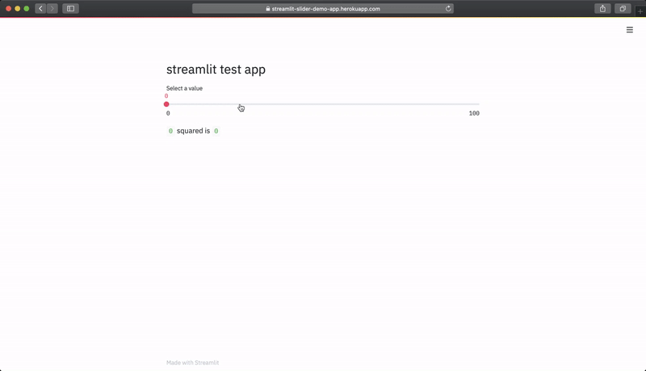

# streamlit




## app\.py

```python
import streamlit as st

st.header('streamlit test app')

x = st.slider('Select a value')
st.write(x, 'squared is', x * x)

```

## usage locally

```
streamlit run app.py
```

## deploy to Heroku

sign up

```
heroku login && heroku create streamlit-slider-demo-app && git push heroku master
```

## result

https://streamlit-slider-demo-app.herokuapp.com/

## Procfile

Specifies deployment

```
web: sh setup.sh && streamlit run app.py
```

## setup\.sh

```
mkdir -p ~/.streamlit/

echo "\
[general]\n\
email = \"mail@gmail.com\"\n\
" > ~/.streamlit/credentials.toml

echo "\
[server]\n\
headless = true\n\
enableCORS=false\n\
port = $PORT\n\
" > ~/.streamlit/config.toml
```

Reference: https://towardsdatascience.com/quickly-build-and-deploy-an-application-with-streamlit-988ca08c7e83